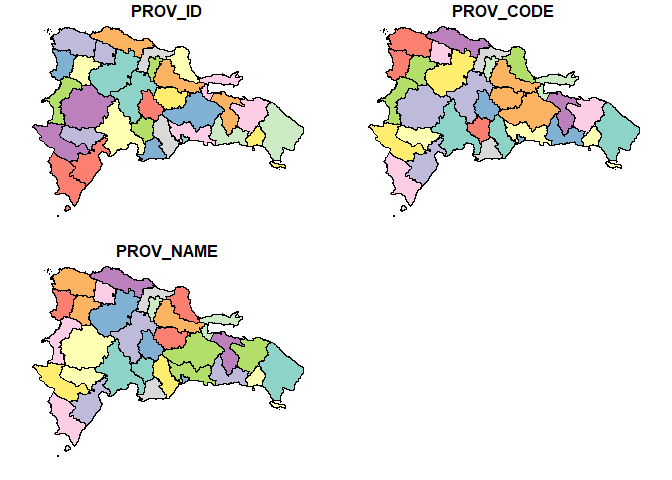
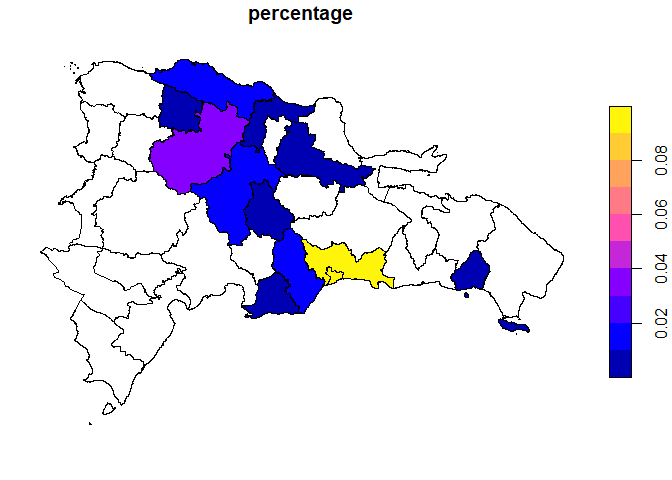
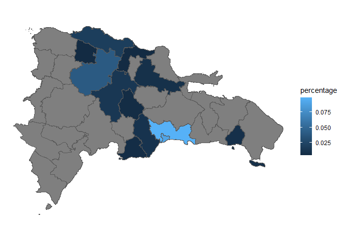

<!-- README.md is generated from README.Rmd. Please edit that file -->

# sfDR <a href="https://adatar-do.github.io/sfDR/"></a>

<!-- badges: start -->

[](https://www.repostatus.org/#wip)
[](https://www.tidyverse.org/lifecycle/#experimental)

<!-- badges: end -->

The goal of sfDR is to provide a comprehensive suite of simple feature
(sf) objects for the administrative boundaries of the Dominican
Republic, facilitating geospatial analysis and mapping.

<style>
div.blue { background-color:#e6f0ff; border-radius: 5px; padding: 20px;}
</style>

<div class="blue">

sfDR is designed to be used through the rgisDR package, which provides
the same and other functions for working with geographic data of the
Dominican Republic in R.

You can install rgisDR from r-universe with:

``` r
install.packages("rgisDR", repos = c("https://adatar-do.r-universe.dev", "https://cloud.r-project.org"))
```

You can visit the [rgisDR website](https://adatar-do.github.io/rgisDR/)
for more information.

</div>

## Installation

You can install the development version of sfDR from r-universe with:

``` r
install.packages("sfDR", repos = c("https://adatar-do.r-universe.dev", "https://cloud.r-project.org"))
```

## Example

This is a basic example showing how to use sfDR to plot a Dominican
Republic province map:

``` r
library(sfDR)

DR_PROV_SF <- dr_provinces()

plot(DR_PROV_SF)
```



Suppose you have a dataset showing the percentage distribution of
remittances received in each province of the Dominican Republic for a
specific year. To visualize this data using a graph with sfDR, you first
need to combine the remittance data with the province data.

``` r
library(dplyr)
#> 
#> Attaching package: 'dplyr'
#> The following objects are masked from 'package:stats':
#> 
#>     filter, lag
#> The following objects are masked from 'package:base':
#> 
#>     intersect, setdiff, setequal, union

 datos <- DR_PROV_SF |>
  left_join(remittance_by_province, by = join_by('PROV_NAME' == 'province'))

datos %>% 
  sf::st_drop_geometry() %>% 
  head()
#>   PROV_ID PROV_CODE              PROV_NAME  percentage
#> 1      21        SC          San Cristóbal 0.010738704
#> 2      14       MTS María Trinidad Sánchez          NA
#> 3      17       PER                Peravia 0.005948295
#> 4      20       SAM                 Samaná          NA
#> 5      18        PP           Puerto Plata 0.018996422
#> 6      11        LA          La Altagracia          NA
```

To get the desired graph, just apply the plot function to your data.

``` r
datos |>
  select(percentage) %>% 
  plot()
```



Next, we show how to achieve a similar result using ggplot2. This serves
to demonstrate how to create maps in both ways and to highlight the
simplicity of the process by integrating everything in one step.

``` r
library(ggplot2)
#> Warning: package 'ggplot2' was built under R version 4.3.1

dr_provinces() %>%
  left_join(remittance_by_province, by = join_by('PROV_NAME' == 'province')) %>% 
  ggplot() +
  geom_sf(aes(fill = percentage)) +
  theme_void()
```



## Code of Conduct

Please note that the sfDR project is released with a [Contributor Code
of Conduct](https://adatar-do.github.io/sfDR/CODE_OF_CONDUCT.html). By
contributing to this project, you agree to abide by its terms.

## License

This project is licensed under the MIT License - see the
[LICENSE.md](LICENSE.md) file for details.
