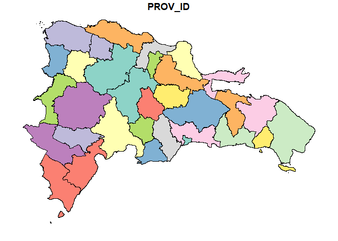
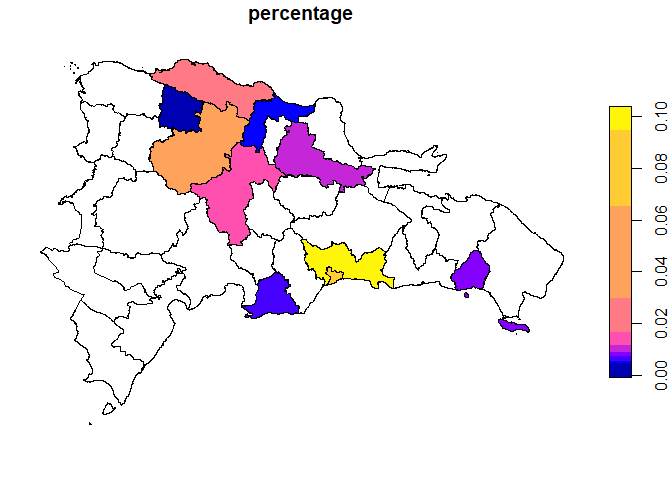
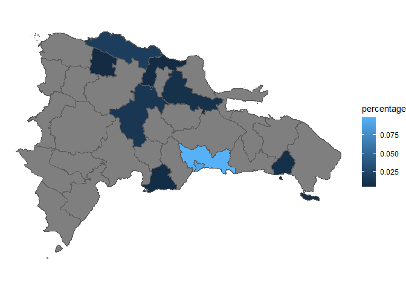

<!-- README.md is generated from README.Rmd. Please edit that file -->

# sfDR <a href="https://adatar-do.github.io/sfDR/"></a>

<!-- badges: start -->

[](https://www.repostatus.org/#wip)
[](https://www.tidyverse.org/lifecycle/#experimental)

<!-- badges: end -->

The goal of sfDR is to provide a comprehensive suite of simple feature
(sf) objects for the administrative boundaries of the Dominican
Republic, facilitating geospatial analysis and mapping.

## Installation

You can install the development version of sfDR from r-universe with:

``` r
if (!require('sfDR')) install.packages('sfDR', repos = c('https://adatar-do.r-universe.dev'))
if (!require('dplyr')) install.packages('dplyr')
if (!require('ggplot2')) install.packages('ggplot2')
```

## Example

This is a basic example showing how to use sfDR to plot a Dominican
Republic province map:

``` r
library(sfDR)
library(dplyr)

DR_PROV_SF <- sf::st_as_sf(DR_PROV)

plot(DR_PROV_SF)
```



Suppose you have a dataset showing the percentage distribution of
remittances received in each province of the Dominican Republic for a
specific year. To visualize this data using a graph with sfDR, you first
need to combine the metadata with the simple features.

``` r
DR_PROV_SF <- DR_PROV_SF |>
  left_join(dr_province, by = join_by(PROV_ID))

DR_PROV_SF %>% 
  sf::st_drop_geometry()
#>    PROV_ID PROV_CODE                  PROV_NAME
#> 1       21        SC             San Cristóbal
#> 2       14       MTS   María Trinidad Sánchez
#> 3       17       PER                    Peravia
#> 4       20       SAM                    Samaná
#> 5       18        PP               Puerto Plata
#> 6       11        LA              La Altagracia
#> 7       07        EP               Elías Piña
#> 8       10       IND              Independencia
#> 9       16       PED                 Pedernales
#> 10      03       BAH                    Baoruco
#> 11      03       BAH                   Bahoruco
#> 12      04       BAR                   Barahona
#> 13      26       SRO        Santiago Rodríguez
#> 14      27       VAL                   Valverde
#> 15      19       HMI           Hermanas Mirabal
#> 16      19       SAL                    Salcedo
#> 17      24       SRA          Sánchez Ramírez
#> 18      13        LV                    La Vega
#> 19      28        MN            Monseñor Nouel
#> 20      31       SJO          San José de Ocoa
#> 21      22        SJ                   San Juan
#> 22      22        SJ     San Juan de la Maguana
#> 23      02       AZU                       Azua
#> 24      25       SAN                   Santiago
#> 25      25       SAN Santiago de los Caballeros
#> 26      06       DUA                     Duarte
#> 27      09       ESP                  Espaillat
#> 28      29        MP                Monte Plata
#> 29      30       HMA                 Hato Mayor
#> 30      12        LR                  La Romana
#> 31      23       SPM      San Pedro de Macorís
#> 32      08        ES                   El Seibo
#> 33      08        ES                   El Seybo
#> 34      01        DN          Distrito Nacional
#> 35      05       DAJ                   Dajabón
#> 36      32        SD              Santo Domingo
#> 37      15        MC               Monte Cristi
```

The original simple features dataset only includes the PROV_ID variable.
Additional variables are incorporated through the dr_province object.

``` r
 datos <- DR_PROV_SF |>
  left_join(remesas_provincias, by = join_by('PROV_NAME' == 'province'))

datos %>% 
  sf::st_drop_geometry()
#>    PROV_ID PROV_CODE                  PROV_NAME  percentage
#> 1       21        SC             San Cristóbal          NA
#> 2       14       MTS   María Trinidad Sánchez          NA
#> 3       17       PER                    Peravia 0.005948295
#> 4       20       SAM                    Samaná          NA
#> 5       18        PP               Puerto Plata 0.018996422
#> 6       11        LA              La Altagracia          NA
#> 7       07        EP               Elías Piña          NA
#> 8       10       IND              Independencia          NA
#> 9       16       PED                 Pedernales          NA
#> 10      03       BAH                    Baoruco          NA
#> 11      03       BAH                   Bahoruco          NA
#> 12      04       BAR                   Barahona          NA
#> 13      26       SRO        Santiago Rodríguez          NA
#> 14      27       VAL                   Valverde 0.004422258
#> 15      19       HMI           Hermanas Mirabal          NA
#> 16      19       SAL                    Salcedo          NA
#> 17      24       SRA          Sánchez Ramírez          NA
#> 18      13        LV                    La Vega 0.014144396
#> 19      28        MN            Monseñor Nouel          NA
#> 20      31       SJO          San José de Ocoa          NA
#> 21      22        SJ                   San Juan          NA
#> 22      22        SJ     San Juan de la Maguana          NA
#> 23      02       AZU                       Azua          NA
#> 24      25       SAN                   Santiago 0.039947667
#> 25      25       SAN Santiago de los Caballeros          NA
#> 26      06       DUA                     Duarte 0.008876070
#> 27      09       ESP                  Espaillat 0.004489833
#> 28      29        MP                Monte Plata          NA
#> 29      30       HMA                 Hato Mayor          NA
#> 30      12        LR                  La Romana 0.008441885
#> 31      23       SPM      San Pedro de Macorís          NA
#> 32      08        ES                   El Seibo          NA
#> 33      08        ES                   El Seybo          NA
#> 34      01        DN          Distrito Nacional 0.090322521
#> 35      05       DAJ                   Dajabón          NA
#> 36      32        SD              Santo Domingo 0.098682428
#> 37      15        MC               Monte Cristi          NA
```

It’s important to note that non-ASCII characters can become corrupted
when stored in the package, which may affect the merging of the data
sets.

> We recommend cleaning any errors before performing the merge. We will
> soon release another package with functions designed to facilitate
> this process.

``` r
datos |>
  select(percentage) %>% 
  plot()
```



To get the desired graph, just apply the plot function to your data.

Next, we show how to achieve a similar result using ggplot2. This serves
to demonstrate how to create maps with both libraries and to highlight
the simplicity of the process by integrating everything in one step.

``` r
library(ggplot2)

DR_PROV %>%
  sf::st_as_sf() %>% 
  left_join(dr_province) %>% 
  left_join(remesas_provincias, by = join_by('PROV_NAME' == 'province')) %>% 
  ggplot() +
  geom_sf(aes(fill = percentage)) +
  theme_void()
#> Joining with `by = join_by(PROV_ID)`
```


